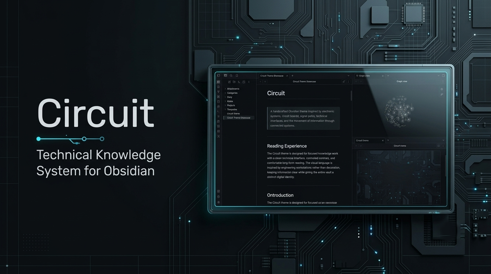
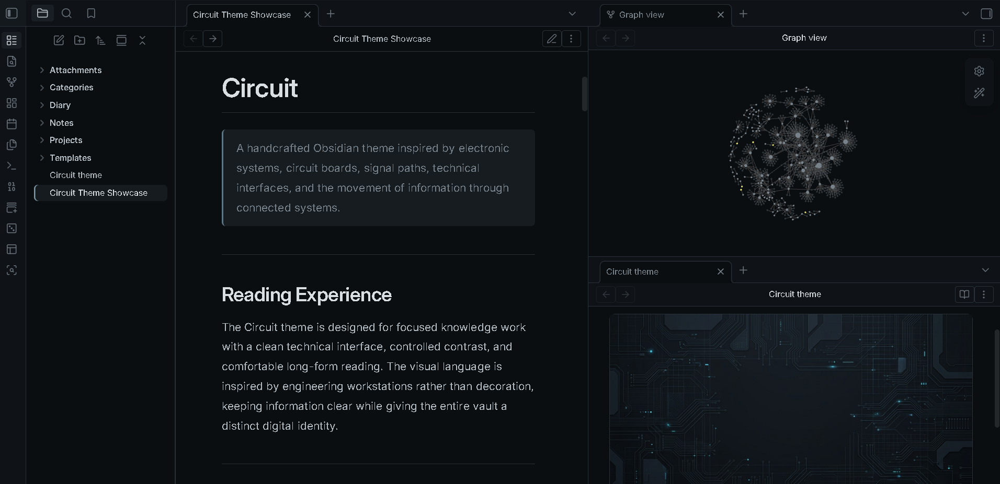
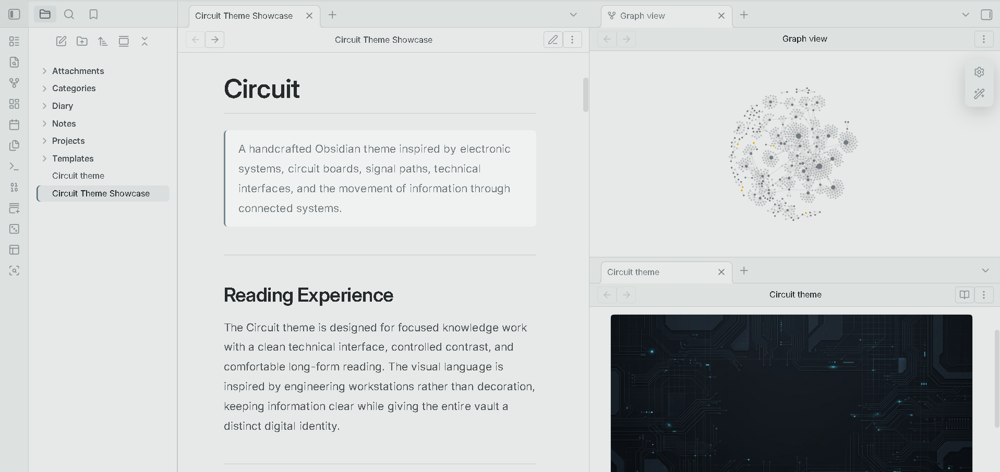
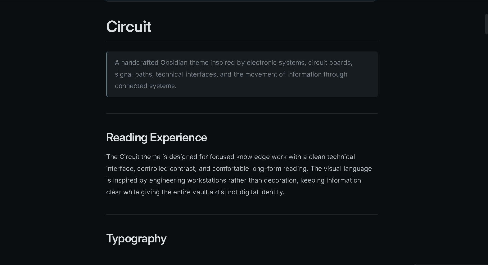
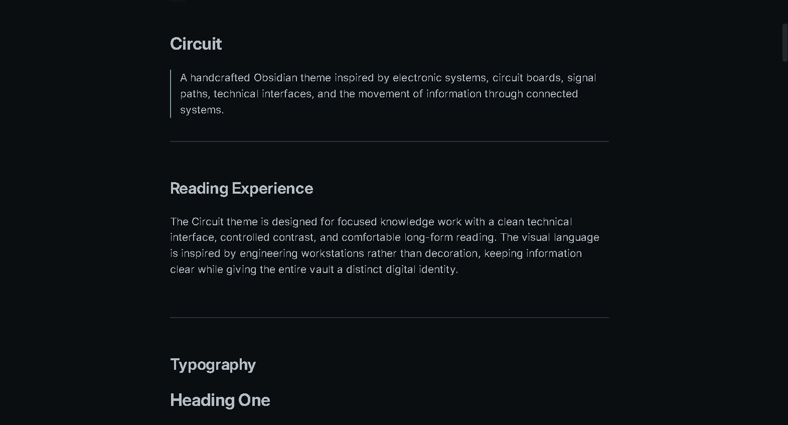
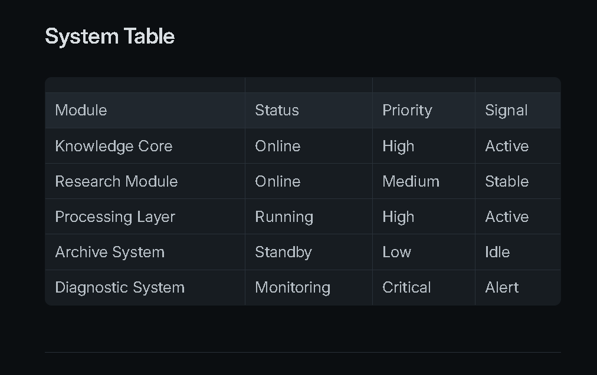
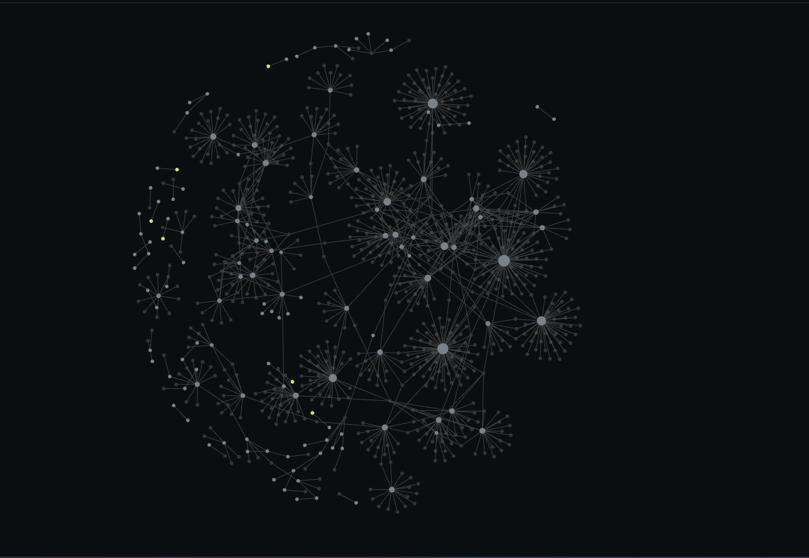
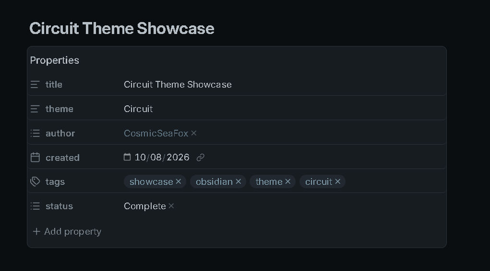
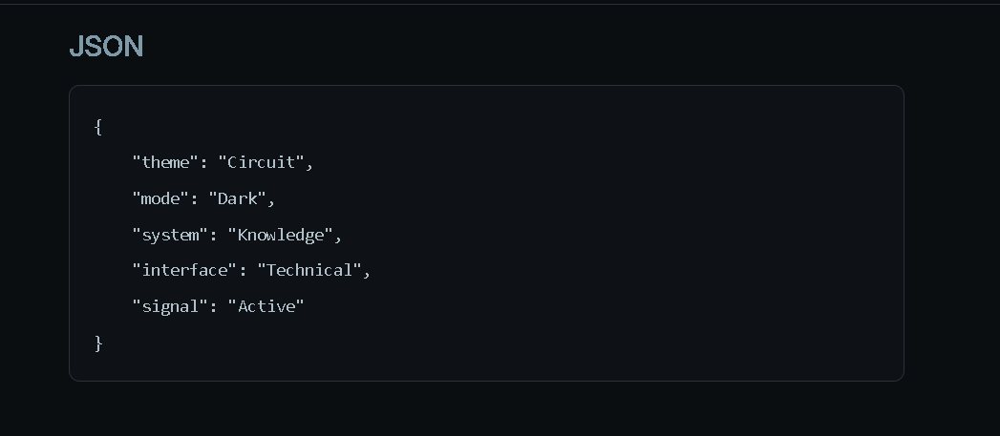
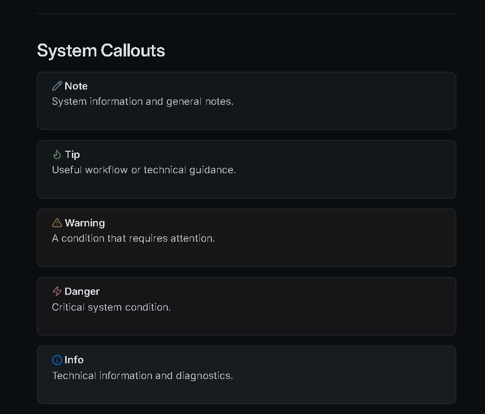

# Circuit


**A technical, engineer-friendly Obsidian theme inspired by circuit boards, signal paths, electronic systems, and connected information.**

Circuit turns your vault into a living information system — where notes become modules, links become connections, and knowledge flows like signals through a network.

Designed for **engineers, developers, researchers, students, makers, and technical thinkers** who work with complex information and interconnected ideas.

---

## Preview



> **Where knowledge flows like a circuit.**

---

## Screenshots

### Dark Mode



Deep technical surfaces with controlled electronic accents, designed for focused work and extended sessions.

### Light Mode



A clean laboratory-inspired environment with bright surfaces and restrained technical accents.

### Reading Mode



A comfortable reading environment for documentation, research, technical notes, and long-form writing.

### Source Mode



A precise editing workspace designed for Markdown, documentation, configuration, and technical writing.

### Tables



Structured data presentation for specifications, experiments, comparisons, measurements, and technical documentation.

### Graph View



A knowledge network inspired by circuit connections, where notes become nodes and relationships become pathways.

### Properties



Clean technical metadata presentation for organizing and identifying information within your vault.

### Code



A focused coding environment with clear syntax surfaces and developer-friendly typography.

### Callouts



System-style information panels for notes, warnings, documentation, experiments, tips, and important information.

---

## Features

| Feature | Description |
|---|---|
| ⚡ Dark Mode | Deep technical workspace with electronic accents |
| 💡 Light Mode | Clean laboratory-inspired workspace |
| 📖 Reading Mode | Focused long-form reading |
| ✍️ Source Mode | Precise technical editing |
| 🔌 Circuit System | Interface inspired by electronic components and signal paths |
| 🟦 Signal Accents | Controlled cyan, blue, and electric highlights |
| 🔗 Connected Links | Links visually represent information pathways |
| 📊 Tables | Structured technical data presentation |
| 💻 Code Blocks | Developer-focused syntax surfaces |
| 🗂 Properties | Technical metadata styling |
| 🕸 Graph View | Knowledge network inspired by circuit connections |
| 🏷 Tags | Compact component-style labels |
| ☑ Tasks | Clear system-status task states |
| 📱 Mobile | Responsive mobile interface |

---

## Built for Engineers & Technical Minds

Circuit is especially suited for:

- ⚙️ Electrical & Electronics Engineers
- 💻 Software Engineers
- 🛠️ Hardware Engineers
- 🤖 Robotics & Automation Engineers
- 🔬 Researchers & Scientists
- 🧪 Engineering Students
- 🖥️ Developers
- 🧰 Makers & DIY Builders
- 📐 System Designers
- 📚 Technical Writers
- 🧠 Knowledge Management

Circuit is not limited to engineering. It is designed for anyone who thinks in **systems, structures, connections, processes, and information flows**.

---

## Design Philosophy

Circuit is built around the idea that a knowledge vault behaves like an electronic system.

- **Notes** become modules.
- **Links** become signal paths.
- **Tags** become identifiers.
- **Properties** become system metadata.
- **Tasks** become processes.
- **Graph View** becomes the circuit network.
- **Code** becomes the technical layer.
- **Canvas** becomes the system board.

The goal is not to make Obsidian look like a literal circuit board.

Instead, Circuit uses the **visual language of technology** to make information feel connected, structured, and alive.

---

## Typography

- **Body:** Inter
- **Headings:** Space Grotesk
- **Code:** JetBrains Mono

Typography is designed to feel technical, modern, and highly readable without becoming overly futuristic.

---

## Installation

1. Download the repository.
2. Copy the theme folder to:

```text
YourVault/.obsidian/themes/
```

3. Open **Obsidian → Settings → Appearance**.
4. Select **Circuit**.

---

## Compatibility

| Feature | Status |
|---|---|
| Desktop | ✅ |
| Mobile | ✅ |
| Reading Mode | ✅ |
| Live Preview | ✅ |
| Graph View | ✅ |
| Properties | ✅ |
| Tables | ✅ |
| Callouts | ✅ |
| Code Blocks | ✅ |
| Dataview | ✅ |
| Tasks | ✅ |
| Canvas | ✅ |
| Excalidraw | ✅ |

---

## Support ☕

If you enjoy Circuit and want to support development:

<a href="https://www.buymeacoffee.com/CosmicSeaFox" target="_blank">

</a>

<a href="https://ko-fi.com/cosmicseafox" target="_blank">

</a>

---

## Credits

**Fonts**

- Inter
- Space Grotesk
- JetBrains Mono

Made for the Obsidian community.

---

## License

MIT License

**Circuit — Where knowledge flows like a circuit.**